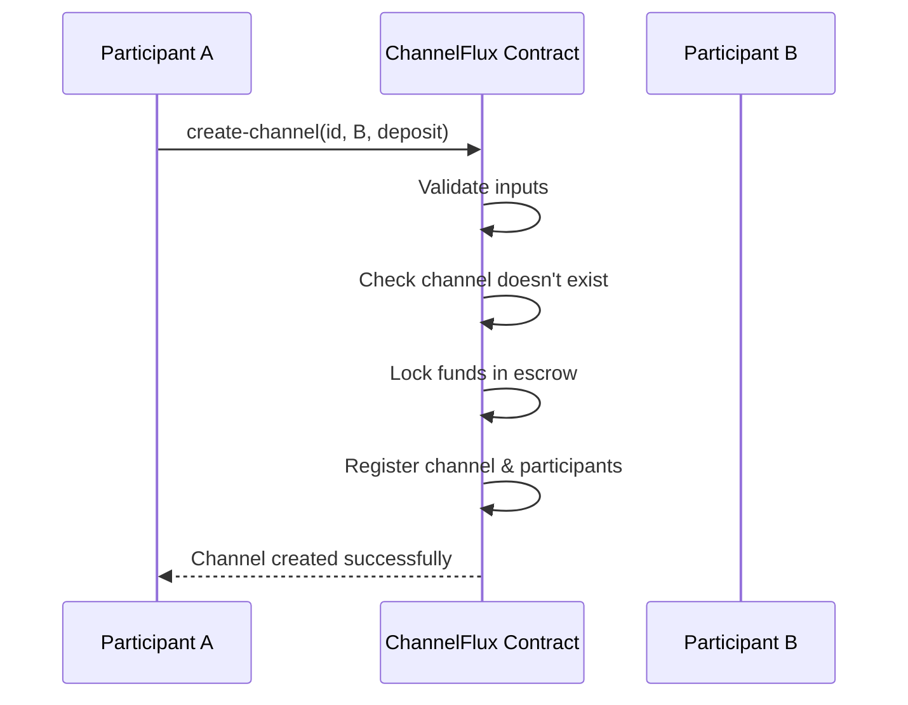
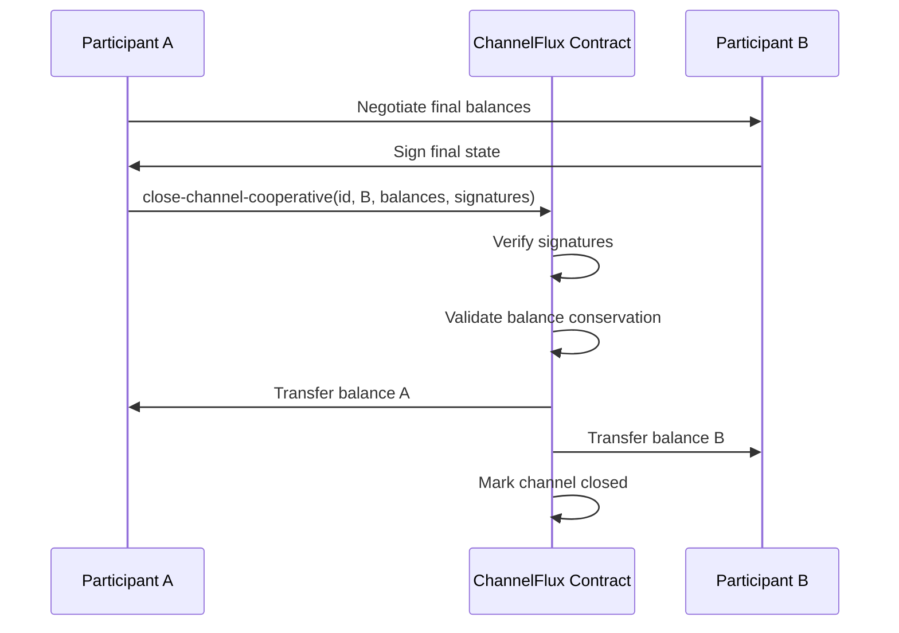
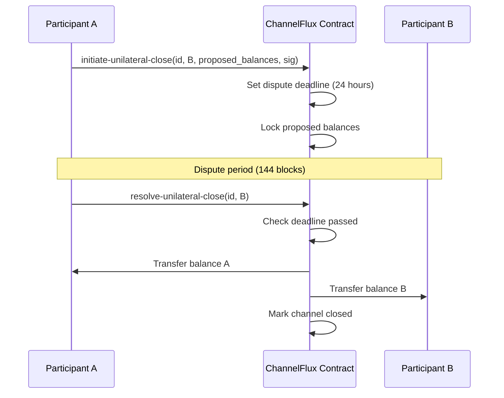

# ChannelFlux

**Trustless Bitcoin-Settled State Channels on Stacks**

[](https://github.com/stacksgov/sips/blob/main/sips/sip-015/sip-015-network-upgrade.md)
[](LICENSE)
[](https://github.com/savi-auto/ChannelFlux)

## Overview

ChannelFlux introduces a next-generation layer for Bitcoin-backed payment channels, designed to combine the scalability of off-chain settlement with the finality of Bitcoin. Built on Stacks, it ensures secure state anchoring, atomic balance resolution, and seamless cross-chain interoperability.

### Key Features

- 🚀 **Off-chain Micropayments**: Instant, low-cost transactions secured by Bitcoin final settlement
- 🔒 **Cooperative & Unilateral Closing**: Flexible dispute resolution mechanisms
- ⚡ **Lightning-Compatible APIs**: Seamless interoperability and routing capabilities
- 🏦 **Non-Custodial Design**: Participants maintain full control of their assets
- ⏰ **Bitcoin-Style Penalties**: Time-locked commitments with penalty enforcement
- 🛡️ **UTXO-Based Balance Model**: Balance commitments modeled after Bitcoin's UTXO principles

## System Overview

ChannelFlux implements a state channel protocol that enables two parties to conduct multiple off-chain transactions while maintaining security through on-chain commitments. The system leverages Stacks' smart contract capabilities to provide Bitcoin-backed security guarantees.

### Core Components

1. **Payment Channels**: Bilateral channels between two participants
2. **State Management**: On-chain state anchoring with off-chain execution
3. **Dispute Resolution**: Time-locked dispute mechanisms with penalty enforcement
4. **Balance Commitments**: Cryptographically secured balance updates

## Contract Architecture

### Data Structures

#### Payment Channels Map

```clarity
{
  channel-id: (buff 32),        ;; Unique 256-bit channel identifier
  participant-a: principal,     ;; Channel initiator
  participant-b: principal      ;; Counterparty
} -> {
  total-deposited: uint,        ;; Total funds locked in escrow
  balance-a: uint,              ;; Participant A's current balance
  balance-b: uint,              ;; Participant B's current balance
  is-open: bool,                ;; Channel operational status
  dispute-deadline: uint,       ;; Dispute resolution timeout (block height)
  nonce: uint                   ;; Sequence counter for replay protection
}
```

#### Channel Participants Map

```clarity
{
  channel-id: (buff 32),
  participant: principal
} -> {
  authorized: bool              ;; Participant authorization status
}
```

### Security Constants

| Constant | Value | Description |
|----------|-------|-------------|
| `MAX-BALANCE` | 1,000,000,000,000 | Maximum balance (1M STX equivalent) |
| `MAX-DISPUTE-BLOCKS` | 1,008 | Maximum dispute period (~1 week) |
| Minimum Deposit | 1,000 | Minimum channel deposit (≥1000 sats equivalent) |

## API Reference

### Channel Lifecycle Functions

#### `create-channel`

Creates a new payment channel between two participants.

```clarity
(create-channel (channel-id (buff 32)) (participant-b principal) (initial-deposit uint))
```

**Parameters:**

- `channel-id`: Unique 256-bit channel identifier
- `participant-b`: Counterparty principal address
- `initial-deposit`: Initial funding amount (minimum 1,000 units)

**Returns:** `(ok true)` on success, error code on failure

---

#### `fund-channel`

Adds additional funds to an existing open channel.

```clarity
(fund-channel (channel-id (buff 32)) (participant-b principal) (additional-funds uint))
```

**Parameters:**

- `channel-id`: Target channel identifier
- `participant-b`: Counterparty principal address
- `additional-funds`: Amount to add to channel

---

#### `close-channel-cooperative`

Closes a channel with mutual agreement from both participants.

```clarity
(close-channel-cooperative 
  (channel-id (buff 32)) 
  (participant-b principal)
  (balance-a uint) 
  (balance-b uint)
  (signature-a (buff 65)) 
  (signature-b (buff 65)))
```

**Parameters:**

- `channel-id`: Channel to close
- `participant-b`: Counterparty address
- `balance-a`: Final balance for participant A
- `balance-b`: Final balance for participant B
- `signature-a`: Participant A's signature on final state
- `signature-b`: Participant B's signature on final state

---

#### `initiate-unilateral-close`

Initiates a unilateral channel closure with dispute period.

```clarity
(initiate-unilateral-close 
  (channel-id (buff 32))
  (participant-b principal)
  (proposed-balance-a uint)
  (proposed-balance-b uint)
  (signature (buff 65)))
```

**Parameters:**

- `channel-id`: Channel to close
- `participant-b`: Counterparty address
- `proposed-balance-a`: Proposed final balance for participant A
- `proposed-balance-b`: Proposed final balance for participant B
- `signature`: Initiator's signature on proposed state

---

#### `resolve-unilateral-close`

Finalizes a unilateral closure after dispute period expires.

```clarity
(resolve-unilateral-close (channel-id (buff 32)) (participant-b principal))
```

### Query Functions

#### `get-channel-info`

Retrieves complete channel information.

```clarity
(get-channel-info (channel-id (buff 32)) (participant-a principal) (participant-b principal))
```

**Returns:** Channel data structure or `none` if not found

---

#### `is-authorized-participant`

Checks if a principal is authorized for a specific channel.

```clarity
(is-authorized-participant (channel-id (buff 32)) (participant principal))
```

**Returns:** `true` if authorized, `false` otherwise

## Data Flow

### Channel Creation Flow



### Cooperative Closure Flow



### Dispute Resolution Flow



## Security Features

### Input Validation

- **Channel ID Validation**: Enforces Bitcoin-compatible 256-bit identifiers
- **Balance Limits**: Prevents overflow with maximum balance constraints
- **Signature Format**: Bitcoin-compatible ECDSA (secp256k1) signatures
- **Participant Verification**: Prevents self-dealing and zero address usage

### Cryptographic Security

- **Nonce-based Replay Protection**: Sequential nonces prevent replay attacks
- **Deterministic Message Construction**: Secure message generation for signatures
- **Multi-signature Verification**: Requires both parties' signatures for cooperative closure

### Economic Security

- **Balance Conservation**: Ensures total balances equal deposited funds
- **Minimum Deposit Requirements**: Prevents dust attacks
- **Time-locked Disputes**: Provides sufficient time for dispute resolution
- **Penalty Enforcement**: Bitcoin-style penalties for malicious behavior

## Error Codes

| Code | Error | Description |
|------|-------|-------------|
| u100 | `ERR-NOT-AUTHORIZED` | Unauthorized access attempt |
| u101 | `ERR-CHANNEL-EXISTS` | Channel already exists |
| u102 | `ERR-CHANNEL-NOT-FOUND` | Channel does not exist |
| u103 | `ERR-INSUFFICIENT-FUNDS` | Insufficient funds for operation |
| u104 | `ERR-INVALID-SIGNATURE` | Invalid or malformed signature |
| u105 | `ERR-CHANNEL-CLOSED` | Operation on closed channel |
| u106 | `ERR-DISPUTE-PERIOD` | Invalid dispute period operation |
| u107 | `ERR-INVALID-INPUT` | Invalid input parameters |
| u108 | `ERR-BALANCE-MISMATCH` | Balance conservation violation |
| u109 | `ERR-UNAUTHORIZED-PARTICIPANT` | Unauthorized channel participant |

## Development

### Prerequisites

- [Clarinet](https://github.com/hirosystems/clarinet) v2.0+
- [Node.js](https://nodejs.org/) v18+
- [Stacks CLI](https://docs.stacks.co/build-apps/tooling/stacks-cli)

### Installation

```bash
git clone https://github.com/savi-auto/ChannelFlux.git
cd ChannelFlux
npm install
```

### Testing

```bash
# Run contract validation
clarinet check

# Run unit tests
npm test

# Run tests with coverage and cost reports
npm run test:report

# Watch mode for development
npm run test:watch
```

### Project Structure

```
ChannelFlux/
├── contracts/
│   └── channel-flux.clar          # Main contract implementation
├── tests/
│   └── channel-flux.test.ts       # Unit tests
├── settings/
│   ├── Devnet.toml               # Development network config
│   ├── Testnet.toml              # Testnet configuration
│   └── Mainnet.toml              # Mainnet configuration
├── Clarinet.toml                 # Clarinet project configuration
├── package.json                  # Node.js dependencies
└── README.md                     # Project documentation
```

## Use Cases

### Micropayments

- **Gaming**: In-game asset transfers and rewards
- **Content**: Pay-per-view content access
- **Services**: API usage and micro-subscriptions

### DeFi Applications

- **Atomic Swaps**: Cross-chain asset exchanges
- **Liquidity Provision**: Efficient capital allocation
- **Yield Farming**: Off-chain computation with on-chain settlement

### Lightning Network Integration

- **Routing**: Multi-hop payment routing
- **Liquidity**: Channel balancing and rebalancing
- **Interoperability**: Cross-layer payment channels

## Roadmap

- [x] **Phase 1**: Core channel functionality
- [x] **Phase 2**: Enhanced security and validation
- [ ] **Phase 3**: Lightning Network compatibility
- [ ] **Phase 4**: Multi-hop routing support
- [ ] **Phase 5**: Cross-chain bridge integration

## Contributing

We welcome contributions! Please see our [Contributing Guidelines](CONTRIBUTING.md) for details.

### Development Workflow

1. Fork the repository
2. Create a feature branch
3. Implement changes with tests
4. Run the test suite
5. Submit a pull request

## License

This project is licensed under the MIT License - see the [LICENSE](LICENSE) file for details.
